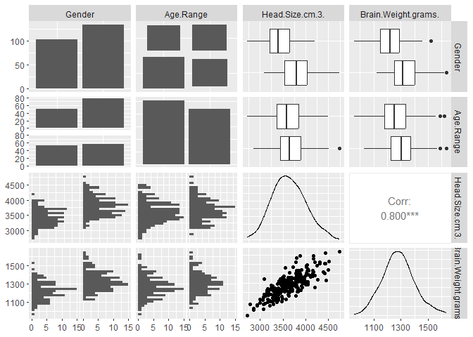
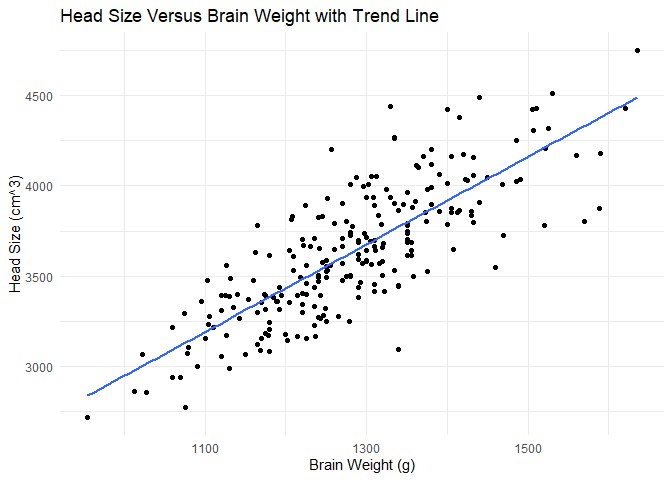
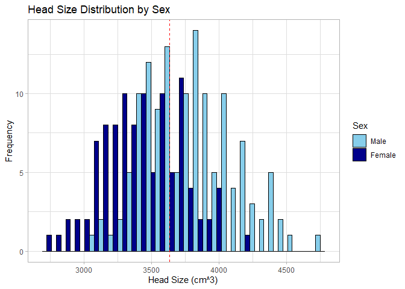
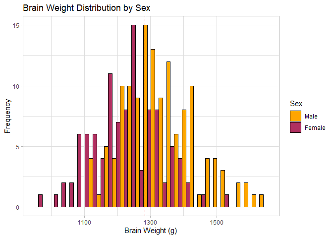
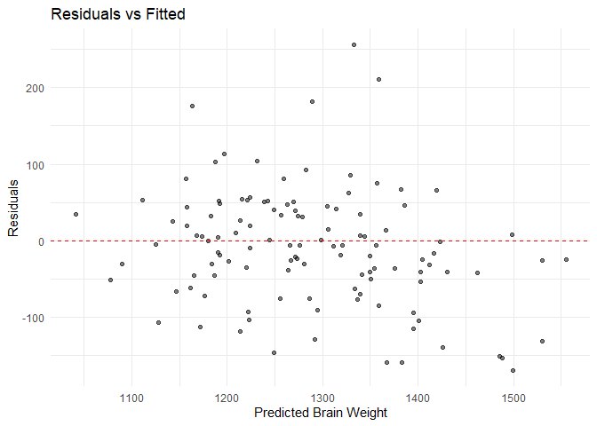
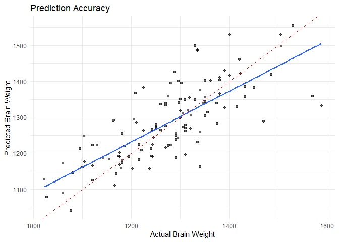
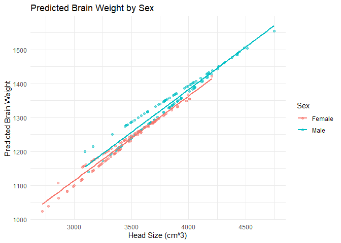
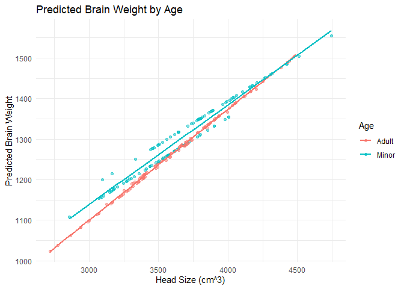
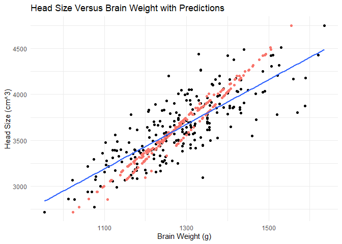

## Introduction

The objective of this project is to analyze data related to brain weight and head size and how it differs between male versus female, and adult versus juvenile humans.

## Background

The data for this project was found on Kaggle. Techniques learned in BIOL-3100 will be used to clean and analyze the data, as well as make models and predictions.

## Data
## Loading Libraries  
I used the tidyverse, GGally, ggplot2, MASS, caret, and easystats packages.  

To tidy the data, I used the mutate() and case_when() functions to change the sex data from numeric values of "1" and "2" to "Male" and "Female," and the age range data from numeric values of "1" and "2" to "Minor" and "Adult."   

## Visualizing Relationships  
The relationship between head size and brain weight appears linear with normal distributions. GLM modeling will be used.  
<!-- -->

```
## 'data.frame':	237 obs. of  4 variables:
##  $ Gender             : chr  "Male" "Male" "Male" "Male" ...
##  $ Age.Range          : chr  "Minor" "Minor" "Minor" "Minor" ...
##  $ Head.Size.cm.3.    : int  4512 3738 4261 3777 4177 3585 3785 3559 3613 3982 ...
##  $ Brain.Weight.grams.: int  1530 1297 1335 1282 1590 1300 1400 1255 1355 1375 ...
```

```
## [1] 237   4
```

<!-- --><!-- --><!-- -->
## Finding the best model  
The stepAIC() function was used to find a stepwise model. The best model was determined to have the following formula: Brain.Weight.grams. ~ Gender + Age.Range + Head.Size.cm.3. + Gender:Age.Range + Age.Range:Head.Size.cm.3.  

```
## 
## Call:
## glm(formula = Brain.Weight.grams. ~ Gender * Age.Range * Head.Size.cm.3., 
##     data = categorized_dat)
## 
## Coefficients:
##                                             Estimate Std. Error t value
## (Intercept)                               219.539906 110.961086   1.979
## GenderMale                                132.848976 147.823752   0.899
## Age.RangeMinor                            180.359069 167.601762   1.076
## Head.Size.cm.3.                             0.290480   0.032829   8.848
## GenderMale:Age.RangeMinor                  65.090701 222.855253   0.292
## GenderMale:Head.Size.cm.3.                 -0.035796   0.041854  -0.855
## Age.RangeMinor:Head.Size.cm.3.             -0.048551   0.048776  -0.995
## GenderMale:Age.RangeMinor:Head.Size.cm.3.  -0.007591   0.062072  -0.122
##                                           Pr(>|t|)    
## (Intercept)                                 0.0491 *  
## GenderMale                                  0.3698    
## Age.RangeMinor                              0.2830    
## Head.Size.cm.3.                           2.45e-16 ***
## GenderMale:Age.RangeMinor                   0.7705    
## GenderMale:Head.Size.cm.3.                  0.3933    
## Age.RangeMinor:Head.Size.cm.3.              0.3206    
## GenderMale:Age.RangeMinor:Head.Size.cm.3.   0.9028    
## ---
## Signif. codes:  0 '***' 0.001 '**' 0.01 '*' 0.05 '.' 0.1 ' ' 1
## 
## (Dispersion parameter for gaussian family taken to be 5065.336)
## 
##     Null deviance: 3417710  on 236  degrees of freedom
## Residual deviance: 1159962  on 229  degrees of freedom
## AIC: 2704.1
## 
## Number of Fisher Scoring iterations: 2
```

```
## Start:  AIC=2704.09
## Brain.Weight.grams. ~ Gender * Age.Range * Head.Size.cm.3.
## 
##                                    Df Deviance    AIC
## - Gender:Age.Range:Head.Size.cm.3.  1  1160038 2702.1
## <none>                                 1159962 2704.1
## 
## Step:  AIC=2702.11
## Brain.Weight.grams. ~ Gender + Age.Range + Head.Size.cm.3. + 
##     Gender:Age.Range + Gender:Head.Size.cm.3. + Age.Range:Head.Size.cm.3.
## 
##                                    Df Deviance    AIC
## - Gender:Head.Size.cm.3.            1  1168205 2701.8
## <none>                                 1160038 2702.1
## - Gender:Age.Range                  1  1174645 2703.1
## - Age.Range:Head.Size.cm.3.         1  1175814 2703.3
## + Gender:Age.Range:Head.Size.cm.3.  1  1159962 2704.1
## 
## Step:  AIC=2701.77
## Brain.Weight.grams. ~ Gender + Age.Range + Head.Size.cm.3. + 
##     Gender:Age.Range + Age.Range:Head.Size.cm.3.
## 
##                             Df Deviance    AIC
## <none>                          1168205 2701.8
## + Gender:Head.Size.cm.3.     1  1160038 2702.1
## - Gender:Age.Range           1  1180002 2702.2
## - Age.Range:Head.Size.cm.3.  1  1184078 2703.0
```

```
## Brain.Weight.grams. ~ Gender + Age.Range + Head.Size.cm.3. + 
##     Gender:Age.Range + Age.Range:Head.Size.cm.3.
```

```
## 
## Call:
## glm(formula = stepwise_mod$formula, data = categorized_dat)
## 
## Coefficients:
##                                 Estimate Std. Error t value Pr(>|t|)    
## (Intercept)                    293.66802   69.22567   4.242  3.2e-05 ***
## GenderMale                       7.08374   15.08374   0.470   0.6391    
## Age.RangeMinor                 199.51588  104.14968   1.916   0.0566 .  
## Head.Size.cm.3.                  0.26846    0.02035  13.194  < 2e-16 ***
## GenderMale:Age.RangeMinor       33.74663   22.09540   1.527   0.1281    
## Age.RangeMinor:Head.Size.cm.3.  -0.05340    0.03014  -1.772   0.0778 .  
## ---
## Signif. codes:  0 '***' 0.001 '**' 0.01 '*' 0.05 '.' 0.1 ' ' 1
## 
## (Dispersion parameter for gaussian family taken to be 5057.165)
## 
##     Null deviance: 3417710  on 236  degrees of freedom
## Residual deviance: 1168205  on 231  degrees of freedom
## AIC: 2701.8
## 
## Number of Fisher Scoring iterations: 2
```

```
##        1        2        3        4        5        6        7        8 
## 1504.351 1337.897 1450.372 1346.284 1432.307 1304.993 1348.005 1299.402 
##        9       10       11       12       13       14       15       16 
## 1311.015 1390.371 1274.455 1392.737 1316.822 1438.974 1358.113 1367.575 
##       17       18       19       20       21       22       23       24 
## 1286.068 1279.402 1199.616 1485.426 1368.005 1404.135 1352.091 1331.876 
##       25       26       27       28       29       30       31       32 
## 1554.890 1485.211 1401.984 1398.973 1276.821 1431.877 1348.435 1350.370 
##       33       34       35       36       37       38       39       40 
## 1416.393 1428.866 1428.221 1354.241 1292.520 1340.048 1251.014 1284.993 
##       41       42       43       44       45       46       47       48 
## 1386.070 1287.789 1461.985 1352.091 1364.779 1401.554 1460.480 1214.670 
##       49       50       51       52       53       54       55       56 
## 1317.037 1317.682 1370.801 1349.725 1452.307 1407.791 1396.823 1277.681 
##       57       58       59       60       61       62       63       64 
## 1370.586 1419.149 1357.135 1285.725 1338.611 1211.631 1493.243 1442.505 
##       65       66       67       68       69       70       71       72 
## 1301.296 1194.449 1217.537 1205.993 1490.022 1476.867 1376.732 1336.464 
##       73       74       75       76       77       78       79       80 
## 1407.068 1389.887 1327.336 1211.899 1255.926 1203.308 1355.793 1330.289 
##       81       82       83       84       85       86       87       88 
## 1328.947 1335.927 1172.973 1261.027 1356.598 1334.316 1189.080 1215.121 
##       89       90       91       92       93       94       95       96 
## 1241.966 1349.618 1417.538 1191.496 1283.846 1347.471 1294.047 1315.256 
##       97       98       99      100      101      102      103      104 
## 1233.107 1237.671 1281.698 1234.450 1239.013 1330.021 1341.296 1283.577 
##      105      106      107      108      109      110      111      112 
## 1272.034 1280.087 1383.175 1213.241 1352.034 1490.022 1292.705 1246.799 
##      113      114      115      116      117      118      119      120 
## 1259.416 1265.591 1208.946 1240.087 1264.248 1347.739 1405.189 1357.672 
##      121      122      123      124      125      126      127      128 
## 1213.241 1428.276 1505.592 1270.960 1388.276 1316.061 1211.094 1139.415 
##      129      130      131      132      133      134      135      136 
## 1388.813 1262.369 1284.920 1248.946 1386.934 1285.188 1107.602 1232.120 
##      137      138      139      140      141      142      143      144 
## 1308.465 1203.302 1160.721 1175.129 1261.367 1252.335 1175.990 1232.550 
##      145      146      147      148      149      150      151      152 
## 1332.551 1331.691 1224.593 1195.775 1235.345 1157.710 1227.173 1207.818 
##      153      154      155      156      157      158      159      160 
## 1284.593 1232.765 1321.798 1171.904 1198.356 1290.400 1354.702 1196.205 
##      161      162      163      164      165      166      167      168 
## 1153.624 1305.884 1256.206 1201.151 1245.238 1155.989 1191.689 1215.345 
##      169      170      171      172      173      174      175      176 
## 1311.045 1260.077 1169.538 1246.528 1261.152 1294.056 1270.615 1182.011 
##      177      178      179      180      181      182      183      184 
## 1269.324 1259.002 1348.896 1252.980 1286.529 1172.334 1354.487 1177.280 
##      185      186      187      188      189      190      191      192 
## 1241.367 1276.421 1274.271 1117.566 1204.815 1287.769 1143.338 1194.077 
##      193      194      195      196      197      198      199      200 
## 1099.043 1283.474 1248.306 1038.103 1114.613 1191.392 1231.393 1178.775 
##      201      202      203      204      205      206      207      208 
## 1195.688 1160.251 1173.406 1327.501 1117.030 1284.816 1206.963 1366.159 
##      209      210      211      212      213      214      215      216 
## 1184.413 1023.874 1082.130 1254.749 1082.667 1096.090 1256.359 1140.922 
##      217      218      219      220      221      222      223      224 
## 1165.084 1144.681 1170.990 1203.473 1201.325 1062.532 1297.702 1227.634 
##      225      226      227      228      229      230      231      232 
## 1272.735 1291.259 1175.285 1422.267 1296.360 1157.567 1282.937 1288.037 
##      233      234      235      236      237 
## 1156.493 1204.815 1161.594 1193.540 1204.010
```
## Training the model  
A data partition was created so a training and testing data set could be used to train the model and make it better. A residuals column was calculated and a residuals plot was created. The residuals plot looked good. The residuals were centered around zero and didn't fan out or curve, so there was no big red flag. It suggested the linear model was reasonably appropriate for the data.  

```
##    Min. 1st Qu.  Median    Mean 3rd Qu.    Max. 
##    2720    3389    3614    3634    3876    4747
```

```
## [1] 119   5
```

```
## [1] 237   5
```

<!-- --><!-- -->

<!-- -->
 
<!-- -->
It appears that sex and age contribute significantly to the predictions. There are separate trend lines for Males, Females, Adults, and Minors. Males are predicted to have greater brain weights than females, and adults are predicted to have greater brain weights than minors. The model accounts for these factors.  
## Plotting the model with the real data  
There is a good general trend, and the model captures the positive linear relationship. However, the model doesn't fully explain all of the variation. In the future, including more predictors or interaction terms could improve the accuracy of the model.  
<!-- -->
## Calculating MSE  

```
## [1] 4929.135
```


